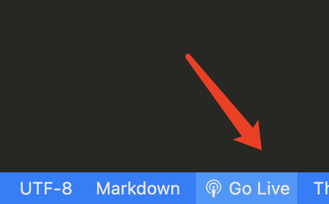

# Tailwind seed template

for easy write code in vscode

# How to use

1. `npm install`
2. `npm start`
3. open live-server in vscode 
4. open `http://127.0.0.1:5500/src/`
5. have enjoy with your awesome tailwind project.
